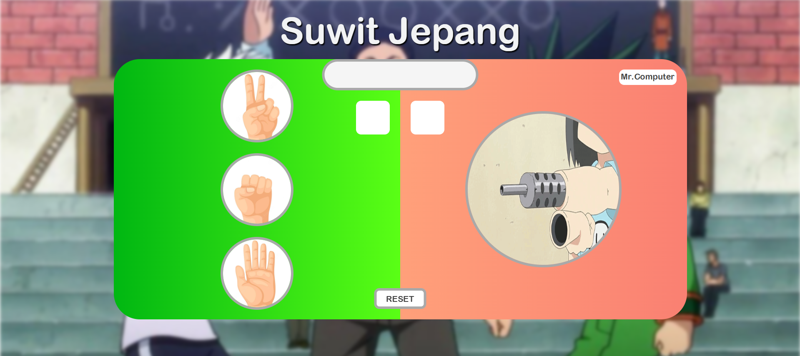

# 🎮 Janken: Japanese Rock-Paper-Scissors Game

Welcome to **Janken**, a web-based, interactive *Rock-Paper-Scissors* (Suwit Jepang) game! Challenge Mr. Computer to an intense battle of luck and strategy. First to reach a score of 10 wins the game!

## ✨ Features
- **Responsive Design**: Play on your desktop, tablet, or mobile phone seamlessly.
- **Interactive UI**: Beautiful gradients, hover effects, and smooth animations.
- **Sound Effects**: Immersive audio cues when you pick a move, win, or lose!
- **Score Tracking**: The game keeps track of your score versus the computer's score.
- **Victory Celebration**: Win 10 times and get showered with a lovely confetti animation! 🎉

## 🛠️ Technologies Used
This project is built from scratch using core web technologies:
- **HTML5**: For semantic structure.
- **Vanilla CSS3**: Utilizing Flexbox for modern, responsive layouts and `@keyframes` for smooth animations.
- **Vanilla JavaScript (ES6)**: For game logic, random computer choices, DOM manipulation, and audio controls.

## 🚀 How to Play
1. **Choose Your Weapon**: Click on the **Gunting (Scissors)**, **Batu (Rock)**, or **Kertas (Paper)** icon on the left side of the screen.
2. **Watch the Result**: The computer will randomly pick its move, and the center info box will declare whether you `MENANG!` (Won), `KALAH!` (Lost), or `SERI!` (Tied).
3. **Score Points**: The first player to reach a score of `10` is crowned the ultimate Janken champion.
4. **Reset**: Want a rematch? Just click the `RESET` button or the `OKAY` button after the game ends to clear the scoreboard and start over.

## 📸 Preview
*Enjoy the sleek user interface and responsive layout!*

---

*Made with ❤️ by mjawadb*
